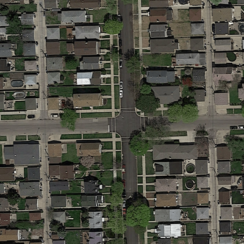

# ml-project-2-atlas_ml
Benjamin KRIEGER, Sam JEGOU, Kilian ZELL

Competition: EPFL ML Road Segmentation Challenge

## Introduction
The goal of this project is to train a classifier to segment roads
from Google Maps satellite images. We developped an encoder-
decoder convolutional neural network that takes as entry
aerial images and gives as output road-segmented images.
By default, such predictions take the form of “masks”,
where roads are visible in white and the background in
black.

<p align="center">
  
  
</p>

To perform this task, we were given a training data-
set consisting of 100 pairs of aerial images and their
corresponding ground-truth, each with a size of 400×400
pixels. Predictions are performed on test images of size 608 × 608 pixels. 
For submission,
predicted masks are cropped into patches of 16 × 16 pixels
and converted into cvs format, where each patch is either
labeled as road (label=1) or background (label=0).

Here is a preview of our predictions on the test set
<p align="center">
  
  
</p>

## Summary
We processed the data according to the following pipeline:
  - Data augmentation
  - Data pre-processing 
  - Processing with a first U-NET 
  - Post-processing of the output 
  - Second U-NET 
  - Morphological processing 
  - Submission into csv

## Folder Structure
```
├── processing  
│   ├── data (not on github)  
│   │   ├── **.png  
│   ├── models (not on github)  
│   │   ├── pretrained_model.tar  
│   ├── **.py  
├── post_processing  
│   ├── data_post (not on github)  
│   │   ├── **.png  
│   ├── models (not on github)  
│   │   ├── pretrained_model.tar  
│   ├── **.py  
├── submission  
│   ├── csv_submission (not on github)  
│   │   ├── **.csv  
│   ├── test_set_images (not on github)  
│   │   ├── **.png  
│   ├── **.py  
├── toolbox  
│   ├── **.py  
├── project2ML_pretrained.ipynb  
├── project2ML.ipynb  
```

## Generating a solution
Our implementation work on Google Colab and we were not able to put our training data into Github.
Therfore we provided a share google drive : https://drive.google.com/drive/folders/1UBIF_md3Xts6_GreIjaJ_SaaYdSBPwE1?usp=sharing  
In order to run our solution:
  - In your Google Drive Use the command "Add shortcut to Drive"
  - Import the jupyter notebook project2ML_pretrained.ipynb or project2ML.ipynb in google collab

As our code take about 4 hours to train we let you choose between 2 jupyter notebook: 
- One that use already trained models stored inside the drive: project2ML_pretrained.ipynb
- The other that let you train the whole model: project2ML.ipynb


## References
Description of the challenge: https://www.aicrowd.com/challenges/epfl-ml-road-segmentation
